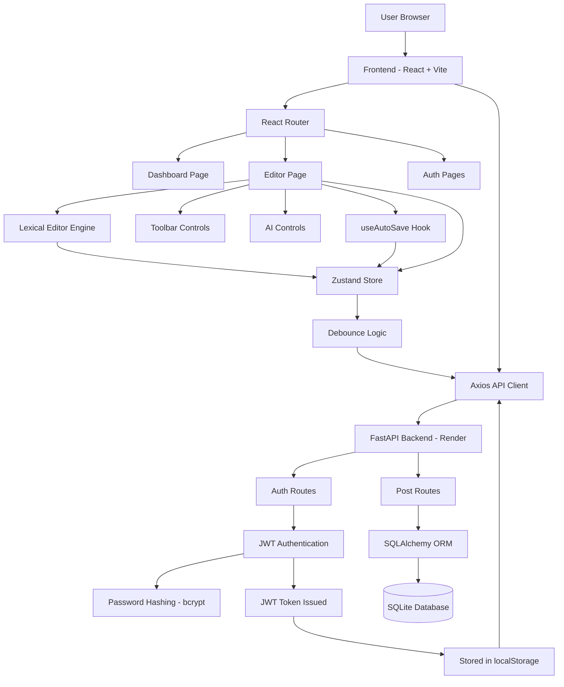
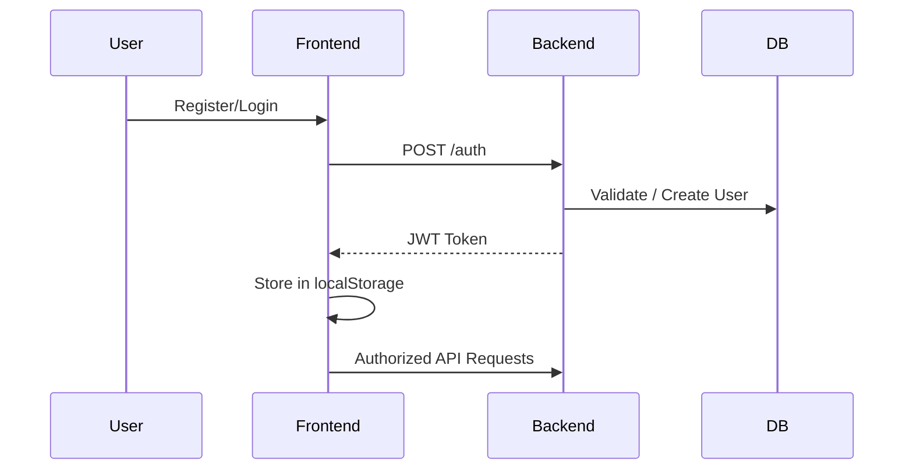
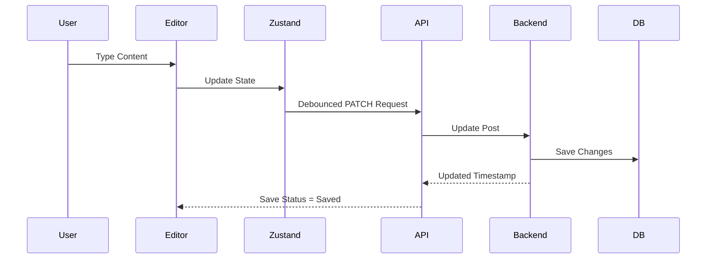

# System Architecture

```mermaid

flowchart TD

%% ===== Client Layer =====
A[User Browser] --> B[Frontend - React + Vite]
B --> C[React Router]
C --> D[Dashboard Page]
C --> E[Editor Page]
C --> F[Auth Pages]

%% ===== Editor Internals =====
E --> G[Lexical Editor Engine]
E --> H[Toolbar Controls]
E --> I[AI Controls]
E --> J[useAutoSave Hook]
E --> K[Zustand Store]

J --> K
G --> K

%% ===== API Layer =====
B --> L[Axios API Client]
L --> M[FastAPI Backend - Render]

%% ===== Backend Layer =====
M --> N[Auth Routes]
M --> O[Post Routes]

N --> P[JWT Authentication]
P --> Q[Password Hashing - bcrypt]

O --> R[SQLAlchemy ORM]
R --> S[(SQLite Database)]

%% ===== Token Flow =====
P --> T[JWT Token Issued]
T --> U[Stored in localStorage]
U --> L

%% ===== Auto-save Flow =====
K --> V[Debounce Logic]
V --> L

```

## Authentication Flow Diagram

```mermaid

sequenceDiagram
participant User
participant Frontend
participant Backend
participant DB

User->>Frontend: Register/Login
Frontend->>Backend: POST /auth
Backend->>DB: Validate / Create User
Backend-->>Frontend: JWT Token
Frontend->>Frontend: Store in localStorage
Frontend->>Backend: Authorized API Requests

```

## Auto-Save Flow Diagram

``` mermaid

sequenceDiagram
participant User
participant Editor
participant Zustand
participant API
participant Backend
participant DB

User->>Editor: Type Content
Editor->>Zustand: Update State
Zustand->>API: Debounced PATCH Request
API->>Backend: Update Post
Backend->>DB: Save Changes
Backend-->>API: Updated Timestamp
API-->>Editor: Save Status = Saved

```